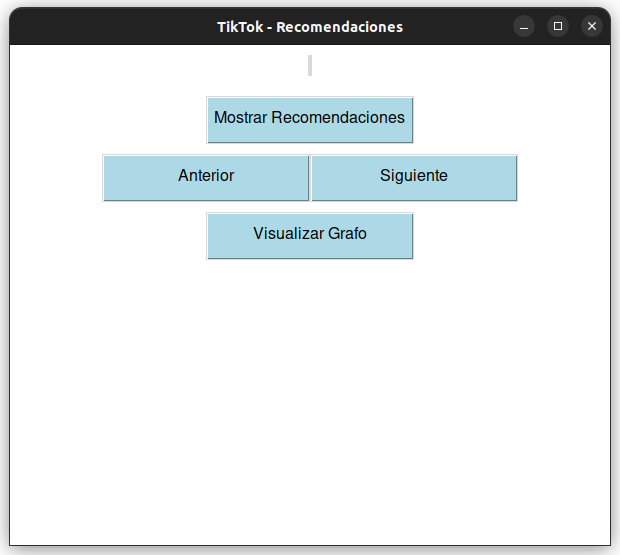
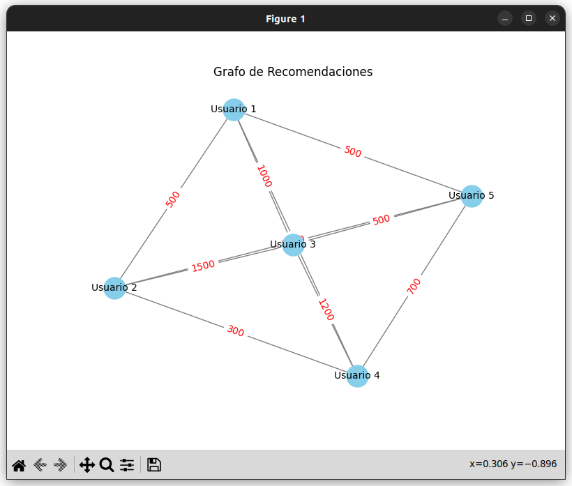

# Prueba de escritorio muy básica del algortimo de TikTok

En este proyecto se trato de realizar una prueba de escritorio del algoritmo la red social TikTok, en la cual se explica con una interfaz grafica muy básica el como las interacciones influyen como primer atributo para la recomendación de videos. Solo evaluamos las interacciones como un conjunto que estaria conformado por {likes, reproducciones, comentarios, guardados y compartidos} por temas de tiempo y practicidad.

## Programa en funcionamiento

